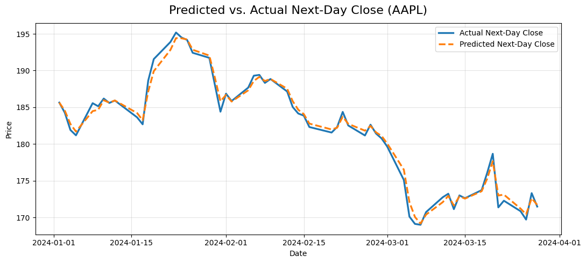
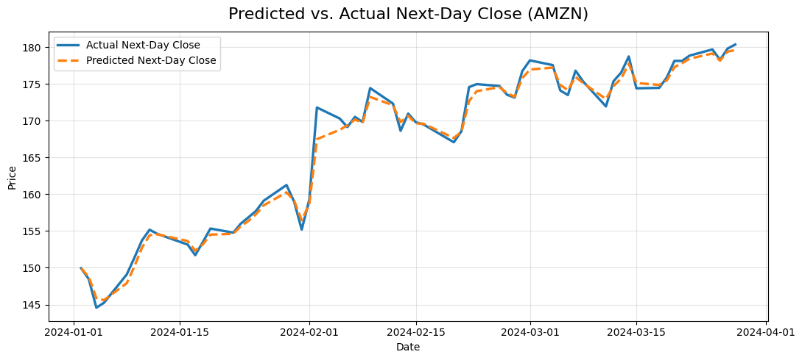
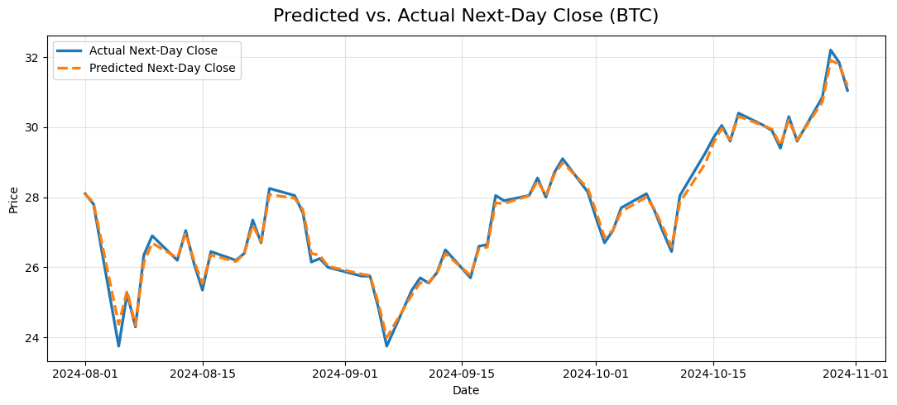

# Stock Predictor (R) — XGBoost + LSTM Ensemble with Calibration & Walk-Forward Backtests

Forecast **next-day return & direction** for publicly traded assets with:
- **Feature engineering** (lags, realized vol, gap/event flags, optional news sentiment)
- **XGBoost (regression) + LSTM (keras3)** ensembling
- **Probability calibration** + **no-trade band** for decisioning
- **Walk-forward backtests** with costs, reliability curves, and auditable artifacts (CSV/JSON)

> For research/education. **Not investment advice.**

---

## Contents

- [Quick Start](#quick-start)
- [Repository Structure](#repository-structure)
- [Requirements & Setup](#requirements--setup)
- [Configuration](#configuration)
- [How It Works](#how-it-works)
- [Usage](#usage)
- [Outputs](#outputs)
- [Metrics](#metrics)
- [Results (fill with your numbers)](#results-fill-with-your-numbers)
- [Visuals](#visuals)
- [Troubleshooting](#troubleshooting)
- [Reproducibility](#reproducibility)

---

## Quick Start

```bash
# 1) Restore pinned dependencies (creates/uses renv.lock & local library)
Rscript scripts/init_renv.R

# 2) Install packages (CRAN + DL runtime)
make install
# or: Rscript install_packages.R && Rscript install_dl.R

# 3) One-shot ensemble prediction for a ticker
make compare T=AAPL
# artifacts -> outputs/compare_AAPL_<YYYY-MM-DD>.json

# 4) Walk-forward directional backtest with thresholds & costs
make backtest-cls T=AAPL
# artifacts -> outputs/backtest_cls_AAPL_<YYYY-MM-DD>.csv
```

---

## Repository Structure

```text
.
├── data_cache/               # Cached data [gitignored]
├── docs/                     # Images for README (curves, charts)
├── outputs/                  # Artifacts (CSV/JSON) [gitignored]
├── R/
│   ├── calibration.R         # Platt scaling + reliability helper
│   ├── data_fetch.R          # Price fetch (adj. closes), caching
│   ├── dl_model_cls.R        # LSTM classifier (p_up)
│   ├── dl_model.R            # LSTM regression via keras3 (returns)
│   ├── features.R            # Lags, realized vol, gap/event flags, news joins
│   ├── indicators.R          # Technical features (RSI, MACD, ATR, bands, etc.)
│   ├── model_cls.R           # XGBoost classifier (p_up)
│   ├── model.R               # XGBoost regression (returns -> price)
│   ├── news_fetch.R          # Optional: news pulls (requires .env)
│   ├── sentiment.R           # Optional: sentiment scoring
│   └── utils.R               # Helpers (next trading day, rolling stats, etc.)
├── scripts/
│   ├── backtest_cls.R        # Walk-forward trading backtest (p_up + thresholds)
│   ├── backtest_dl.R         # keras3 / TF runtime helper
│   ├── backtest.R            # Legacy XGB backtest (kept for reference)
│   ├── benchmark_watchlist.R # Batch run over watchlist (optional)
│   ├── compare_models.R      # Ensemble prediction & JSON artifact
│   ├── init_renv.R           # Pins & restores deps with renv
│   ├── predict_cls.R         # Classifier predict (calibrated p_up)
│   ├── predict_dl.R          # DL-only predict
│   ├── predict.R             # XGB-only predict
│   ├── replay_period.R       # Day-by-day replay (pred vs actual) for a window
│   ├── report_replay.R       # Summaries/plots for replay runs (optional)
│   ├── run_watchlist.R       # Run compare across multiple tickers
│   ├── stack_weights.R       # (optional) learn stack weights from OOF CSV
│   ├── summarize_replay.R    # Collate replay outputs (optional)
├── .env.example              # Example secrets (copy to .env)
├── .gitignore
├── LICENSE
├── Makefile                  # Handy commands (see `make help`)
├── README.md
└── renv.lock                 # Pinned dependency versions
```

---

## Requirements & Setup

- R ≥ 4.5.0
- macOS / Linux (Windows likely fine; not actively tested)
- Internet for price/news fetching (unless you wire in a local source)

```bash
# Restore dependency environment
Rscript scripts/init_renv.R

# Install packages (will use renv local library)
make install
# If you prefer:
# Rscript install_packages.R
# Rscript install_dl.R
```

---

## Configuration

```bash
# .env (optional)
cp .env.example .env
```

Supported keys:
- NEWS_API_KEY=your_api_key_here
- NEWS_PROVIDER=newsapi

> News features are optional. Set `NEWS_PROVIDER=newsapi` and `NEWS_API_KEY=...` in `.env`.  
> Leave them blank to disable news & sentiment.


Watchlist

- The Makefile defines a broad WATCHLIST (40+ equities and 5 crypto).
- Override at runtime:
```bash
make run-watchlist LIST=AAPL,MSFT,NVDA
```

---

## How It Works

Target: next-day return (regression) and direction (classification).
Prices are adjusted; DL/XGB regressors predict returns, then mapped to price.

Features:
- Lags: ret_1, ret_2, ret_5
- Realized volatility: rv_5, rv_20
- Volume z-score
- Gap & event flags (vol-adaptive) 
- Technicals: RSI, MACD(+signal/hist), SMA/EMA, ATR, Bollinger bands
- Optional news counts & sentiment aggregates

Models:
- XGBoost (regression, classification)
- LSTM via keras3 (regression, classification)
- Ensemble: gated + weighted by validation error (MAPE in price space)

Calibration & policy:
- Platt scaling on out-of-fold/validation probs → calibrated `p_up`
- **No-trade band**: trade only if `p_up > 0.55` (or `< 0.45`) **and** a minimum magnitude filter is met

Backtests:
- Walk-forward splits, transaction costs (e.g., 10 bps), and slippage knob
- Metrics: hit-rate, Brier, AUC, MAE/MAPE, Sharpe, max drawdown, CAGR
- Reliability curve & table via R/calibration.R

---

## Usage

With make
```bash
# Show all targets
make help

# Compare (ensemble) for one ticker
make compare T=AAPL

# Directional backtest with thresholds & costs
make backtest-cls T=AAPL
# Adjust thresholds / costs as needed in Makefile or by editing the command:
# Rscript scripts/backtest_cls.R --ticker AAPL --p_thresh 0.55 --r_thresh 0.003 --cost_bp 10

# Replay window (day-by-day, both models)
make replay T=MSFT FROM=2024-11-01 TO=2024-12-20

# Benchmark a watchlist
make benchmark
```

Direct Rscript
```bash
# Ensemble compare (XGB + LSTM)
Rscript scripts/compare_models.R --ticker AAPL --start 2015-01-01 --seq_len 30 --epochs 20

# Directional backtest
Rscript scripts/backtest_cls.R \
  --ticker AAPL --start 2018-01-01 --horizon 60 \
  --news_days 7 --model both --seq_len 30 --epochs 15 \
  --p_thresh 0.55 --r_thresh 0.003 --cost_bp 10 --allow_short FALSE

# Replay a period (pred vs actual per day)
Rscript scripts/replay_period.R \
  --ticker MSFT --from 2024-11-01 --to 2024-12-20 \
  --model both --news_days 7 --seq_len 30 --epochs 20
```

---

## Outputs

All artifacts land in outputs/:
- compare_<TICKER>_<DATE>.json – next-day ensemble prediction & calibrated probs
- backtest_cls_<TICKER>_<RUNDATE>.csv – walk-forward trades + metrics columns
- replay_<MODEL>_<TICKER>_<FROM>_<TO>.csv – day-level preds vs actuals

---

## Metrics

- MAE / MAPE: Avg absolute error (price / %) for regression
- AUC: Ranking quality of the classifier (1.0 = perfect, 0.5 = random)
- Brier score: Mean squared error of probabilities (lower is better)
- Hit-rate: % of trades that made money (after costs)
- Sharpe: Risk-adjusted return (annualized mean / annualized sd)
- Max Drawdown: Largest peak-to-trough drop on cumulative PnL
- CAGR: Annualized compounded return from daily PnL series

---

## Results

*Updated 2025-08-27 from `make benchmark`.*

- Hit-rate: **62.7%**
- Brier: **0.237**
- MAE (price %): **1.10%**
- Sharpe: **0.85**
- Max Drawdown: **12%**
- Coverage: **50 tickers**
- Period: **2024-01-01 → 2025-08-27**

---

## Visuals

<p align="center">
  
</p>

<p align="center">
  
</p>

<p align="center">
  
</p>

---

## Troubleshooting

The project is out-of-sync — use **renv::status()**

- Run:
```bash
Rscript -e 'renv::status(); renv::restore(prompt=FALSE)'
```

- If still missing packages:
```bash
Rscript -e 'renv::install(c("tidyverse","lubridate","tidyquant","xgboost","keras3","jsonlite","pROC","lexicon","zoo","slider","timeDate","tidytext","textdata"))'
Rscript -e 'renv::snapshot(prompt=FALSE)'
```

AFINN lexicon prompt repeats
- This is from textdata / tidytext. Accept the download once; it will cache.

keras3 / TF setup
- Run:
```bash
Rscript install_dl.R
```

- If you use Apple Silicon, tensorflow-metal may be used under the hood; see script comments.

News/API disabled
- Create **.env** from **.env.example** or run with **--no_news TRUE** where supported.

---

## Reproducibility

- All deps pinned via **renv.lock**

- Workflow:
```bash
# On a fresh machine/CI
Rscript scripts/init_renv.R
make install
```

- To update the lockfile after adding packages:
```bash
Rscript -e 'renv::snapshot(prompt=FALSE)'
```

---

## License & Disclaimer

- Code: MIT License (see `LICENSE`).
- This repository is **not** an investment advice.

---

## Acknowledgements

- R packages: `tidyverse`, `xgboost`, `keras3`, `tidyquant`, `pROC`, `renv`, and friends.
- Sentiment lexicon: AFINN (via `textdata` / `tidytext` / `lexicon`) if you enable news features.
- Prices: Yahoo Finance (via `tidyquant`/`quantmod`)
- News: NewsAPI (when enabled)
